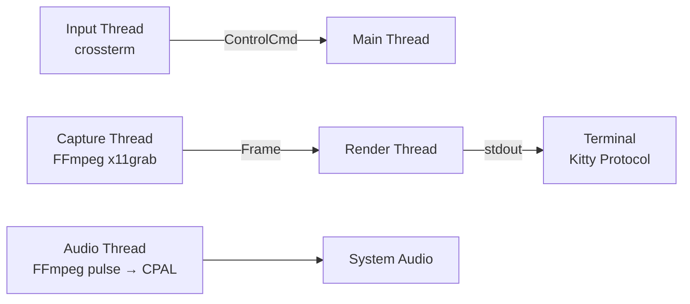

# kitweb

**A real web browser, inside your terminal.**

kitweb runs in a terminal that supports the Kitty graphics protocol:
[Ghostty](https://ghostty.org/)
[Kitty](https://sw.kovidgoyal.net/kitty/)
[WezTerm](https://wezterm.net/)
[cmux](https://github.com/manaflow-ai/cmux)

[![demo]](https://github.com/user-attachments/assets/5e281a50-c9d1-46ec-b0a2-b90fc6f5de21)

[longer version(1:21)](https://youtu.be/4gXUf2f0F5w?si=zx8OURgsqvzqGsPi) at youtube.

## Installation

```
cargo install kitweb
```

Make sure these are installed:

    sudo apt install ffmpeg xvfb

## How To Use

```bash
kitweb https://youtube.com
```

Watch a video, scroll a page, click a link, type into a search box — all in the terminal you already have open over SSH.

---

## Why kitweb?

- 🖥️ **Pixel-perfect rendering** — frames are streamed at the browser's native
  resolution and drawn with the Kitty Graphics Protocol, not downsampled to text.
- 🖱️ **Fully interactive** — click links and buttons, scroll with the mouse or
  arrow keys, tab between fields, and type into inputs.
- 🔊 **Real audio** — Chromium audio is routed through PulseAudio/PipeWire and
  played back via CPAL, including over SSH with Pulse forwarding.
- ⚡ **Smooth and responsive** — a four-thread pipeline keeps capture, render,
  input, and audio independent, so video keeps playing even while you type.
- 🛰️ **Built for remote** — it's just a terminal app. Run it on a beefy Linux box
  and drive it from your laptop over SSH.

## How it works

kitweb runs Chrome in a headless X server (Xvfb), captures the screen with FFmpeg
x11grab, and streams live RGBA frames into your terminal using the [Kitty Graphics
Protocol](https://sw.kovidgoyal.net/kitty/graphics-protocol/) — at native pixel
resolution, no scaling. You get a clickable, scrollable, audio-playing browser
without ever leaving the shell.



The render thread paces frames to your target FPS and writes them to stdout via the
Kitty protocol. A bounded capture→render channel drops frames instead of blocking,
so capture never stalls. Navigation and input are driven through **xdotool**.

**Linux only.** kitweb's pipeline is built on X11/Linux tooling — **Xvfb** for
the headless display, FFmpeg **x11grab** for capture, **xdotool** for input, and
**PulseAudio/PipeWire** for audio. There is no macOS or Windows support; the only
cross-platform piece is `build.rs` linking FFmpeg. You can still drive it from a
Mac or Windows terminal over SSH — it just has to run on a Linux host.


### System dependencies (Linux)

```bash
apt install xvfb xdotool libavdevice-dev pulseaudio-utils pipewire-pulse \
            libasound2-dev libasound2-plugins
# plus google-chrome or chromium-browser
```

| Dependency | Purpose |
|------------|---------|
| `xvfb` | Virtual X server Chrome runs inside |
| `google-chrome` / `chromium-browser` | The browser itself |
| `xdotool` | Navigation, scrolling, clicks, and keystrokes |
| `libavdevice-dev` | FFmpeg x11grab screen capture |
| `pulseaudio-utils` | `pactl` to create/remove the browser audio sink |
| `pipewire-pulse` / `pulseaudio` | Pulse-compatible server for audio capture |
| `libasound2-dev`, `libasound2-plugins` | CPAL/ALSA output (incl. SSH Pulse forwarding) |

`build.rs` links FFmpeg via `pkg-config` (`libavformat`, `libavcodec`,
`libavutil`, `libavdevice`, `libswscale`, `libswresample`). On macOS it falls
back to `/opt/homebrew/lib`.

## Build & run

```bash
cargo run -- https://example.com
cargo run -- --width 1920 --height 1080 --fps 30 https://example.com
cargo run -- --no-audio https://example.com
```

### Options

Set `KITWEB_FORCE=1` to bypass the terminal check.

| Flag | Default | Description |
|------|---------|-------------|
| `<url>` | *(required)* | The page to open |
| `--width` | `1680` | Browser viewport width in pixels |
| `--height` | `1260` | Browser viewport height in pixels |
| `--fps` | `30` | Capture frame rate |
| `--display` | `99` | Xvfb display number |
| `--no-audio` | off | Disable audio capture/playback |
| `--audio-capture-server` | — | Pulse/PipeWire server for Chromium audio capture |

Frames render at native browser pixel size — the image is **not** scaled to the
terminal's cell grid.

## Key bindings

| Key | Action |
|-----|--------|
| `o` / `l` | Open URL prompt |
| `i` | Text input prompt (sends text + Enter to the page) |
| `r` | Reload page |
| `m` | Toggle audio mute |
| `+` / `=` | Volume up |
| `-` | Volume down |
| Arrow keys | Scroll / navigate |
| Space | Scroll down |
| Page Up / Page Down | Page scroll |
| Tab / Shift+Tab | Move focus forward / backward |
| Home / End / Esc | Forwarded to the browser |
| Mouse click | Click at that spot in the page |
| Mouse scroll | Scroll the page |
| `q` / Ctrl+C | Quit (cleans up Xvfb, Chrome, and the audio sink) |

## Audio over SSH

kitweb creates a per-process Pulse null sink for Chromium, captures that sink's
monitor with FFmpeg, and plays it through CPAL. For SSH-to-Mac audio, keep the
PulseAudio forwarding setup (see `kitim/docs/ssh-linux.md`) and leave
`PULSE_SERVER=127.0.0.1:24713` in the Linux shell — kitweb prefers the local
Linux Pulse socket for capture when available.

## Troubleshooting

Xvfb and Chrome logs are suppressed by default so desktop warnings don't corrupt
the terminal UI. To see them while debugging launch issues:

```bash
KITWEB_CHILD_LOGS=1 cargo run -- https://example.com
```

---

Built in Rust with hand-written FFmpeg bindings and the Kitty Graphics Protocol.
